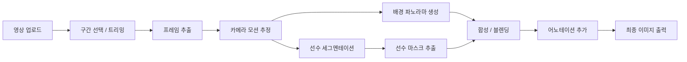

# 스포츠 어니언스키닝 (Motion Composite) 앱 기술 검토 및 구현 계획

## 📌 개요

NYT 스타일의 스포츠 모션 합성 이미지를 **영상 입력**으로부터 자동 생성하는 앱을 만들기 위한 기술 검토 문서.

> **참고 이미지**: Chloe Kim의 Cab Double Cork 1080 — 하프파이프 영상을 프레임별로 분해하고, 배경을 파노라마로 스티칭한 위에 선수의 각 프레임을 합성한 이미지.

---

## ✅ 결론: **구현 가능**

현재 사용 가능한 오픈소스 기술 스택으로 핵심 파이프라인을 모두 구현할 수 있음. 다만, 영상 조건(카메라 움직임, 조명, 해상도)에 따라 품질 차이가 크므로 **반자동(semi-automatic)** 접근이 현실적.

---

## 🔧 핵심 파이프라인



---

## 📋 단계별 기술 요구사항

### 0단계: 영상 업로드 & 구간 선택 (Video Upload & Clip Selection)

| 항목 | 내용 |
|------|------|
| **기술** | Gradio `gr.Video` + 커스텀 타임라인 UI |
| **난이도** | ⭐⭐ (보통) |
| **핵심** | 영상을 업로드하고, 어니언스키닝할 구간(시작/끝 시점)을 선택 |
| **출력** | 선택된 구간의 시작/끝 타임스탬프 + 트리밍된 영상 |

**UI 구성요소**:

```
┌─────────────────────────────────────────────────┐
│  🎬 영상 업로드 (드래그 앤 드롭 / 파일 선택)       │
├─────────────────────────────────────────────────┤
│  [▶ 비디오 프리뷰 플레이어]                        │
│                                                 │
│  ├──●━━━━━━━━━━━━━━━●──┤  타임라인 슬라이더      │
│  0:00  시작▲      끝▲  0:30                     │
│                                                 │
│  [썸네일 프리뷰 스트립]                            │
│  ┌───┐┌───┐┌───┐┌───┐┌───┐┌───┐┌───┐┌───┐      │
│  │ 1 ││ 2 ││ 3 ││ 4 ││ 5 ││ 6 ││ 7 ││ 8 │      │
│  └───┘└───┘└───┘└───┘└───┘└───┘└───┘└───┘      │
│                                                 │
│  선택 구간: 0:03.2 ~ 0:08.7 (5.5초, ~165 프레임)  │
│  프레임 간격: [자동 ▾]  추출 프레임 수: [15 ▾]     │
│                                                 │
│  [구간 확인 & 다음 단계 →]                        │
└─────────────────────────────────────────────────┘
```

**기술 구현 세부사항**:

```python
import gradio as gr
import cv2

def extract_clip(video_path, start_sec, end_sec):
    """선택된 구간만 추출"""
    cap = cv2.VideoCapture(video_path)
    fps = cap.get(cv2.CAP_PROP_FPS)
    start_frame = int(start_sec * fps)
    end_frame = int(end_sec * fps)
    
    cap.set(cv2.CAP_PROP_POS_FRAMES, start_frame)
    clip_frames = []
    for i in range(start_frame, end_frame):
        ret, frame = cap.read()
        if not ret: break
        clip_frames.append(frame)
    return clip_frames

def generate_thumbnail_strip(video_path, n_thumbnails=8):
    """타임라인 썸네일 스트립 생성"""
    cap = cv2.VideoCapture(video_path)
    total = int(cap.get(cv2.CAP_PROP_FRAME_COUNT))
    indices = [int(i * total / n_thumbnails) for i in range(n_thumbnails)]
    thumbnails = []
    for idx in indices:
        cap.set(cv2.CAP_PROP_POS_FRAMES, idx)
        ret, frame = cap.read()
        if ret:
            thumb = cv2.resize(frame, (120, 68))
            thumbnails.append(thumb)
    return thumbnails

# Gradio UI
with gr.Blocks() as upload_ui:
    video = gr.Video(label="영상 업로드")
    start = gr.Slider(0, 100, label="시작 시점 (초)")
    end = gr.Slider(0, 100, label="끝 시점 (초)")
    gallery = gr.Gallery(label="선택 구간 프리뷰")
    btn = gr.Button("구간 확인 & 프레임 추출")
```

**고려사항**:
- 대용량 영상(1GB+) 업로드 시 **청크 업로드** 또는 서버사이드 처리
- 모바일에서도 동작하도록 반응형 타임라인 UI
- 영상 메타데이터 자동 표시 (FPS, 해상도, 코덱, 길이)
- FFmpeg로 구간 트리밍 시 **re-encoding 없이 빠른 추출** (`-c copy`)
- 선택 구간이 너무 길면 경고 (30초 이상 → 프레임 수 과다)

**지원 포맷**:
`MP4`, `MOV`, `AVI`, `MKV`, `WebM` — FFmpeg 기반으로 대부분의 코덱 지원

---

### 1단계: 프레임 추출 (Video Frame Extraction)

| 항목 | 내용 |
|------|------|
| **기술** | OpenCV `cv2.VideoCapture` |
| **난이도** | ⭐ (쉬움) |
| **핵심** | 일정 간격 또는 키프레임 기반으로 프레임 추출 |
| **선택 사항** | 사용자가 프레임 간격/개수를 조절할 수 있는 UI |

```python
# 기본 구현
cap = cv2.VideoCapture("input.mp4")
frames = []
while cap.isOpened():
    ret, frame = cap.read()
    if not ret: break
    frames.append(frame)
```

**고려사항**:
- FPS가 높은 영상(120fps+)의 경우 모든 프레임이 필요하지 않음
- 선수 움직임이 적은 프레임은 건너뛰기 (optical flow 기반 필터링)

---

### 2단계: 카메라 모션 추정 (Homography Estimation)

| 항목 | 내용 |
|------|------|
| **기술** | OpenCV Feature Matching + Homography |
| **난이도** | ⭐⭐⭐ (보통~어려움) |
| **알고리즘** | SIFT/ORB → BFMatcher/FLANN → `cv2.findHomography(RANSAC)` |
| **목적** | 카메라가 이동한 경우, 각 프레임 간의 변환 행렬 계산 |

```python
# 프레임 간 호모그래피 추정
sift = cv2.SIFT_create()
kp1, des1 = sift.detectAndCompute(frame1, None)
kp2, des2 = sift.detectAndCompute(frame2, None)

matches = cv2.BFMatcher().knnMatch(des1, des2, k=2)
# Lowe's ratio test
good = [m for m, n in matches if m.distance < 0.75 * n.distance]

H, mask = cv2.findHomography(src_pts, dst_pts, cv2.RANSAC, 5.0)
```

**핵심 도전 과제**:
- 선수가 화면의 많은 부분을 차지하면 배경 특징점이 부족 → **선수 마스크를 제외하고 매칭** 필요
- 카메라 팬/줌이 있는 경우 누적 호모그래피 오차 관리
- 중계 영상의 경우 카메라 워크가 복잡할 수 있음

---

### 3단계: 배경 파노라마 생성 (Background Panorama Stitching)

| 항목 | 내용 |
|------|------|
| **기술** | OpenCV Image Warping + Multi-band Blending |
| **난이도** | ⭐⭐⭐⭐ (어려움) |
| **방법** | 호모그래피로 프레임 워핑 → 중앙값/평균 기반 배경 합성 |
| **대안** | `cv2.Stitcher` (단순한 경우) |

**전략: 선수를 제외한 배경만 합성**
```python
# 각 프레임에서 선수를 제외한 영역만 사용하여 배경 생성
# median composite는 움직이는 객체를 자연스럽게 제거
background = np.median(warped_frames_without_player, axis=0)
```

**핵심 도전 과제**:
- 스노우보드 하프파이프처럼 넓은 시야각 → 파노라마가 크게 늘어남
- 블렌딩 이음새 처리 (Laplacian pyramid blending, feathering)
- 조명 변화가 있는 경우 색상/밝기 보정 필요

---

### 4단계: 선수 세그멘테이션 (Player Segmentation)

| 항목 | 내용 |
|------|------|
| **기술** | SAM 2 (Segment Anything Model 2) / YOLO + SAM |
| **난이도** | ⭐⭐⭐ (보통, 모델 사용은 쉬움) |
| **목적** | 각 프레임에서 선수 영역을 픽셀 단위로 분리 |

**권장 접근법**: 
1. **YOLO v8/v11** (ultralytics)로 선수 바운딩 박스 검출
2. **SAM 2** (Meta)로 정밀 세그멘테이션 마스크 생성
3. 첫 프레임에서 프롬프트 → 이후 프레임 자동 추적 (SAM 2 video mode)

```python
from ultralytics import YOLO, SAM

# Step 1: 선수 검출
yolo = YOLO("yolov8x.pt")
results = yolo(frame)
bbox = results[0].boxes[0].xyxy  # 선수 bbox

# Step 2: SAM으로 정밀 마스크
sam = SAM("sam2_l.pt")
mask = sam(frame, bboxes=bbox)
```

**대안들**:
- `rembg` (간단한 배경 제거, 품질 낮음)
- MOG2/KNN 배경 차감 (고정 카메라 전용)
- Mask R-CNN (traditional instance segmentation)

**핵심 도전 과제**:
- 스노우보드 장비(보드, 고글)가 선수 몸과 분리되지 않도록
- 눈/얼음 위의 선수 → 배경과 색상이 비슷할 수 있음
- 공중 동작 시 비정형 포즈 처리

---

### 5단계: 합성 및 블렌딩 (Compositing)

| 항목 | 내용 |
|------|------|
| **기술** | Alpha Blending, Poisson Blending |
| **난이도** | ⭐⭐⭐ (보통) |
| **목적** | 파노라마 배경 위에 N개의 선수 마스크를 자연스럽게 배치 |

```python
# 각 프레임의 선수를 배경 파노라마 위에 배치
for i, (frame, mask, H) in enumerate(zip(frames, masks, homographies)):
    # 선수 좌표를 파노라마 좌표계로 변환
    warped_player = cv2.warpPerspective(frame * mask, H, panorama_size)
    warped_mask = cv2.warpPerspective(mask, H, panorama_size)
    
    # 알파 블렌딩
    alpha = opacity_schedule(i, total_frames)  # 시간순 투명도 조절
    panorama = panorama * (1 - warped_mask * alpha) + warped_player * alpha
```

**시각적 효과 옵션**:
- 시간 순서에 따른 **투명도 그래디언트** (오래된 프레임 → 반투명)
- 선수별 **색상 틴트** 적용
- **그림자/글로우** 효과로 깊이감 추가
- **궤적선** (trajectory arc) 오버레이

---

### 6단계: 어노테이션 (Annotation & Labels)

| 항목 | 내용 |
|------|------|
| **기술** | Pillow / matplotlib / SVG |
| **난이도** | ⭐⭐ (쉬움~보통) |
| **목적** | 높이 표시, 트릭 이름, 궤적 등 정보 추가 |

NYT 이미지처럼:
- 높이 눈금 (포즈 추정으로 자동 계산 가능)
- 트릭 이름, 회전 수 라벨
- 궤적 곡선 (포즈의 중심점을 연결)

---

## 🛠 기술 스택 요약

### 필수 기술

| 카테고리 | 기술/라이브러리 | 용도 |
|----------|----------------|------|
| 영상 처리 | **OpenCV** (Python) | 프레임 추출, 호모그래피, 워핑, 블렌딩 |
| 딥러닝 세그멘테이션 | **SAM 2** (Meta) | 정밀 선수 마스크 추출 |
| 객체 검출 | **YOLO v8/v11** (Ultralytics) | 선수 바운딩 박스 검출 |
| 이미지 처리 | **Pillow / scikit-image** | 후처리, 어노테이션 |
| GPU 가속 | **PyTorch + CUDA** | SAM/YOLO 추론 |

### 선택 기술 (고급 기능)

| 카테고리 | 기술/라이브러리 | 용도 |
|----------|----------------|------|
| 포즈 추정 | **MediaPipe / MMPose** | 높이 측정, 자세 분석, 궤적 중심점 |
| 비디오 안정화 | **vidstab** | 흔들리는 영상 보정 |
| 인페인팅 | **LaMa / OpenCV Inpaint** | 선수 제거 후 배경 복원 |
| 광학 흐름 | **OpenCV Optical Flow** | 움직임 기반 프레임 선택 |
| UI 프레임워크 | **Gradio / Streamlit** | 웹 인터페이스 |

---

## ⚠️ 주요 도전 과제 & 리스크

### 난이도가 높은 부분

1. **카메라 모션이 복잡한 중계 영상**
   - 줌인/아웃, 빠른 팬 → 호모그래피 누적 오차
   - 해결: 카메라 모션이 부드러운 구간만 선택하거나, 고정 카메라 영상 권장

2. **선수-배경 경계 품질**  
   - 세그멘테이션 마스크 경계가 거칠면 합성 품질 저하
   - 해결: SAM 2의 고해상도 모드 사용, matting 후처리 (alpha matte refinement)

3. **선수들 간 겹침 (Occlusion)**
   - 동일 선수의 서로 다른 시점이 겹치는 경우 시각적 혼란
   - 해결: 프레임 간격 조절, 투명도 제어, 적절한 프레임 수 선택

4. **비정형 촬영 환경**
   - 조명 변화, 관중 움직임, 반사광 등
   - 해결: 중앙값 기반 배경 합성으로 움직이는 객체 제거

### 영상 입력 조건별 난이도

| 영상 조건 | 난이도 | 비고 |
|-----------|--------|------|
| **고정 카메라 + 깨끗한 배경** | ⭐⭐ | 가장 먼저 지원. 스케이트파크 연습영상 등 |
| **느린 팬 + 단일 선수** | ⭐⭐⭐ | 하프파이프 중계 영상 수준 |
| **빠른 카메라 워크 + 다수 선수** | ⭐⭐⭐⭐⭐ | 매우 어려움, 수동 개입 필요 |

---

## 📐 구현 순서 (MVP → 확장)

### Phase 1: MVP (1~2주)
- [ ] 영상 업로드 & 구간 선택 UI (Gradio 기반)
- [ ] 고정 카메라 영상에서 프레임 추출
- [ ] SAM 2로 선수 세그멘테이션
- [ ] 단순 합성 (프레임을 그대로 한 장에 배치)
- [ ] CLI 인터페이스

### Phase 2: 카메라 모션 대응 (2~3주)
- [ ] 호모그래피 기반 프레임 정렬
- [ ] 배경 파노라마 스티칭
- [ ] 알파 블렌딩 / 투명도 제어
- [ ] 웹 UI (Gradio)

### Phase 3: 고급 기능 (3~4주)
- [ ] 포즈 추정 → 궤적/높이 자동 계산
- [ ] 어노테이션 자동 생성
- [ ] 인페인팅으로 배경 복원
- [ ] 프레임 자동 선택 (optical flow 기반)
- [ ] 다양한 출력 스타일 (NYT 스타일, 스트로보 스타일 등)

### Phase 4: 프로덕션 (4주+)
- [ ] GPU 서버 배포 (Cloud Run / Modal)
- [ ] 배치 처리 지원
- [ ] 다양한 스포츠 지원 (피겨, 체조, BMX 등)

---

## 🧪 PoC (Proof of Concept) 제안

빠른 검증을 위해 아래 순서로 PoC 진행 권장:

1. **YouTube에서 하프파이프 영상 다운로드** (고정 카메라 구간)
2. **OpenCV로 10~20 프레임 추출**
3. **SAM 2로 선수 마스크 추출**
4. **프레임들을 하나의 캔버스에 합성**
5. **결과물 확인 후 호모그래피 정렬 추가**

PoC 예상 소요시간: **2~3시간** (환경 세팅 포함)

---

## 📂 프로젝트 구조 (제안)

```
sports-onion-skinning/
├── README.md
├── requirements.txt
├── src/
│   ├── clip_selector.py        # 영상 업로드, 구간 선택, 트리밍
│   ├── frame_extractor.py      # 영상 → 프레임
│   ├── homography.py           # 카메라 모션 추정
│   ├── panorama.py             # 배경 파노라마 생성
│   ├── segmentation.py         # SAM/YOLO 선수 세그멘테이션
│   ├── compositor.py           # 합성 엔진
│   ├── annotator.py            # 라벨/궤적 추가
│   └── pipeline.py             # 전체 파이프라인 통합
├── app.py                      # Gradio 웹 UI
├── config.yaml                 # 설정 파일
└── examples/
    ├── input/                  # 테스트 영상
    └── output/                 # 결과 이미지
```

---

## 🔗 참고 자료

- [SAM 2 (Meta)](https://github.com/facebookresearch/sam2) — 비디오 세그멘테이션
- [Ultralytics YOLO](https://docs.ultralytics.com/) — 객체 검출
- [OpenCV Stitcher](https://docs.opencv.org/4.x/d2/d8d/classcv_1_1Stitcher.html) — 이미지 스티칭
- [LaMa Inpainting](https://github.com/advimman/lama) — 이미지 인페인팅
- [Gradio](https://gradio.app/) — 웹 UI

---

*문서 작성: 2026-02-13 | 이 문서는 다른 에이전트가 구현 시 참조할 수 있도록 작성됨*
